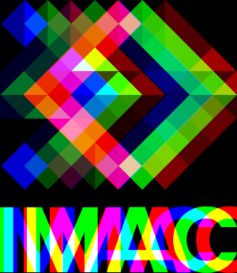
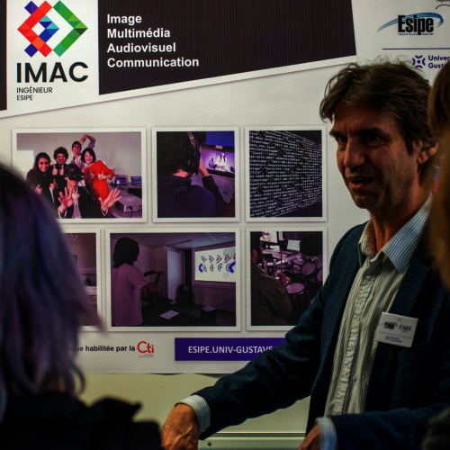
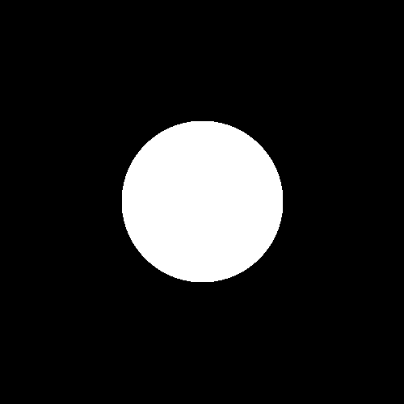
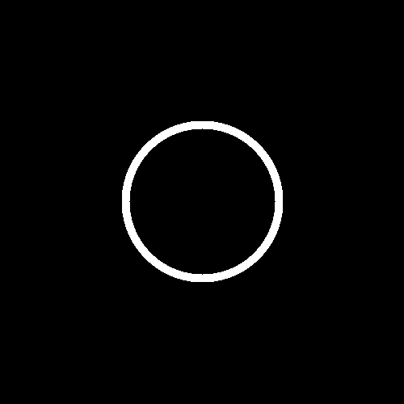
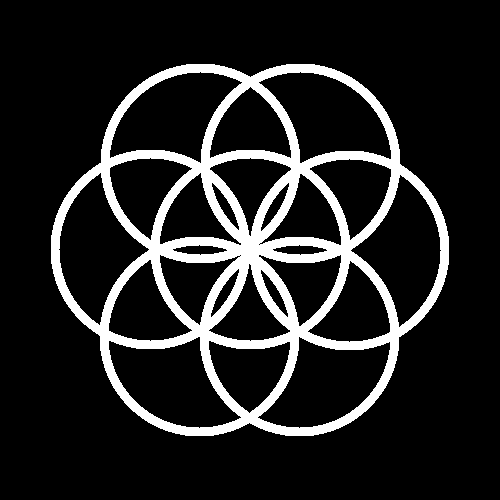
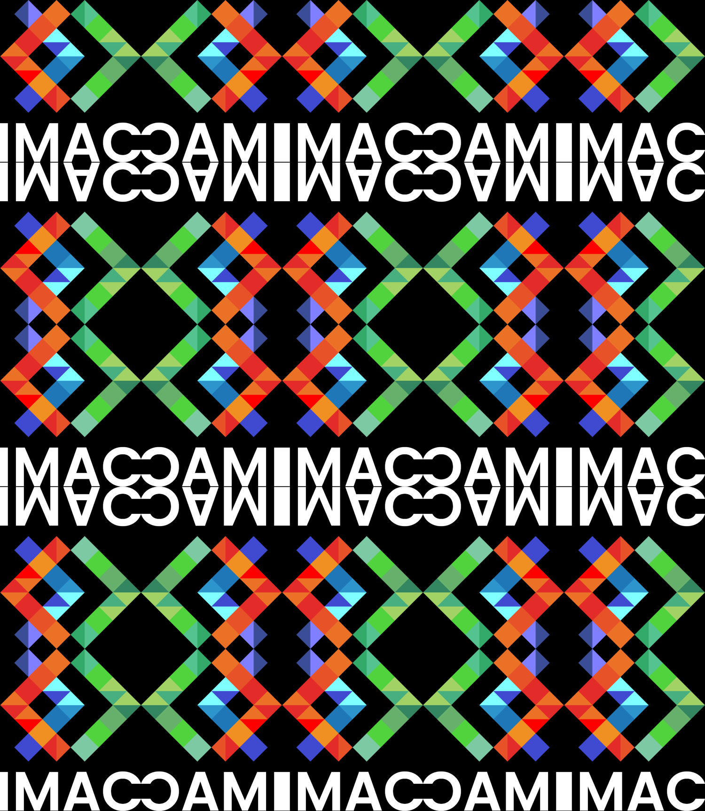
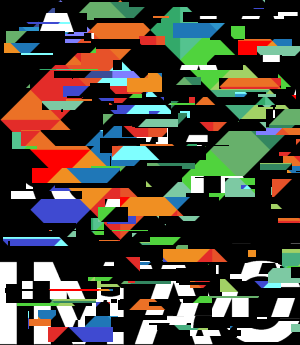
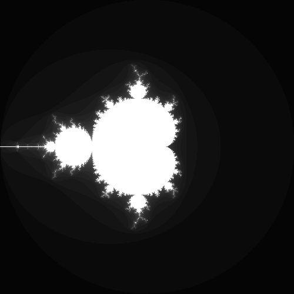
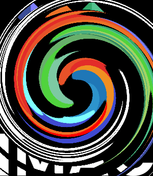

# 💻 Programmation algorithmique - IMAC 1 - WORKSHOP 💻
<p align="center">
    
</p>

📆 20 - 27 Novembre 2023

*Contributeur : Angèle DOUET - Colin OLIVIER*

*Super Superviseur :* [Jules Fouchy](https://github.com/JulesFouchy)

- [💻 Programmation algorithmique - IMAC 1 - WORKSHOP 💻](#-programmation-algorithmique---imac-1---workshop-)
  - [Introduction](#introduction)
  - [Résultats](#résultats)
    - [⭐ Ne garder que le vert](#-ne-garder-que-le-vert)
    - [⭐ Échanger les canaux](#-échanger-les-canaux)
    - [⭐ Noir \& Blanc](#-noir--blanc)
    - [⭐ Négatif](#-négatif)
    - [⭐ Dégradé](#-dégradé)
    - [⭐⭐ Miroir](#-miroir)
    - [⭐⭐ Image bruitée](#-image-bruitée)
    - [⭐⭐ Rotation de 90°](#-rotation-de-90)
    - [⭐⭐ RGB split](#-rgb-split)
    - [⭐⭐ Luminosité](#-luminosité)
    - [⭐⭐ Disque](#-disque)
    - [⭐ Cercle](#-cercle)
    - [⭐⭐⭐ Rosace](#-rosace)
    - [⭐⭐ Mosaïque](#-mosaïque)
    - [⭐⭐⭐ Mosaïque miroir](#-mosaïque-miroir)
    - [⭐⭐⭐ Glitch](#-glitch)
    - [⭐⭐⭐ Fractale de Mandelbrot](#-fractale-de-mandelbrot)
    - [⭐⭐⭐(⭐) Vortex](#-vortex)
    - [⭐⭐⭐(⭐) Tramage](#-tramage)
    - [⭐⭐⭐⭐ Convolutions](#-convolutions)
    - [⭐ Netteté, Contours, etc.](#-netteté-contours-etc)
    - [⭐⭐⭐⭐ Tri de pixels](#-tri-de-pixels)
    - [⭐⭐⭐⭐⭐ Filtre de Kuwahara (effet peinture à l'huile)](#-filtre-de-kuwahara-effet-peinture-à-lhuile)


## Introduction
Au cours du premier semestre d’enseignement à l’IMAC, nous avons eu l’opportunité de participer à un workshop de programmation algorithmique encadré par Jules Fouchy. L’occasion parfaite pour approfondir nos connaissances en C++. 

Nous avons pu découvrir (ou redécouvrir) comment coder des effets sur des images ainsi que certains concepts de synthèse d'image. Nous nous sommes donc transformés en véritables Photoshop manuels pendant une semaine.
Ayant des niveaux très hétérogènes en C++, nous nous sommes beaucoup apportés tant en connaissances qu’en conseils. 

En vue de rendre compte de manière fidèle de ces cinq jours de programmation intensive, nous présenterons les effets réalisés dans le temps imparti, accompagnés parfois de quelques commentaires explicatifs.


## Résultats


### ⭐ Ne garder que le vert

|  |  |
| ------------------------------- | -------------------------------------- |
| **Input**                       | **Output**                             |

```cpp
    for (glm::vec3& color : image.pixels())
    {
        color.r = 0.f;
        color.b = 0.f;
    }
```
Pour ne garder que le vert de l'image, nous avons mis les canaux rouge et bleu à 0.

### ⭐ Échanger les canaux

|  |  |
| ------------------------------- | ------------------------------------------ |
| **Input**                       | **Output**                                 |

Nous avons utilisé deux méthodes:
- Avec une variable de stockage
```cpp
    for (glm::vec3& color : image.pixels())
        {
            float red;
            red=color.r;
            color.r=color.b;
            color.b=red;
        }
```
- Avec la fonction `std::swap`
```cpp
    for (glm::vec3& color : image.pixels())
    {
        std::swap(color.r,color.b);
    }
```

### ⭐ Noir & Blanc

|  |  |
| ------------------------------- | ------------------------------- |
| **Input**                       | **Output**                      |

```cpp
for (glm::vec3& color : image.pixels())
    {
        float const niveau_de_gris{(color.r+color.b+color.g)/3};
        color = glm::vec3{niveau_de_gris, niveau_de_gris, niveau_de_gris};
    }
```
Pour chaque canal de la nouvelle image, nous avons additionné les différentes valeurs des canaux et nous les avons divisé par 3 pour qu'elles aient toutes la même valeur.
Pourquoi ne pas les avoir juste mises à la même valeur dès le départ? Si nous faisions ça, nous ne prenions pas en compte les couleurs d'origine de l'image et nous obtenions une image entièrement grise.

### ⭐ Négatif

|  |  |
| ------------------------------- | ----------------------------------- |
| **Input**                       | **Output**                          |

### ⭐ Dégradé

|  |
| ----------------------------------- |
| **Output**                          |

Nous déterminons la couleur du pixel en fonction de sa position en x.

### ⭐⭐ Miroir

|  |  |  |
| ------------------------------- | ---------------------------------- | -------------------------------------- |
| **Input**                       | **Output**                         | **Output loupé**                       |

```cpp
image.pixel(x, y)=image.pixel(image.width()-1-x, y);
```
Il y a eu un raté en pensant que nous pouvions transformer les pixels d'un coté par ceux de l'autre coté sans passer par une copie de l'image. Cela nous a amené à créer une nouvelle formation: la CAAC!


### ⭐⭐ Image bruitée

|  |  |
| ------------------------------- | --------------------------------- |
| **Input**                       | **Output**                        |

### ⭐⭐ Rotation de 90°

|  |  |
| ------------------------------- | -------------------------------------- |
| **Input**                       | **Output**                             |

```cpp
copie.pixel(image.height()-1-y,x)=image.pixel(x,y);
```
**Rq:** Nous aurions aussi pu échanger les x et les y et ensuite appliquer le programme du miroir!

### ⭐⭐ RGB split

|  |  |
| ------------------------------- | ------------------------------------ |
| **Input**                       | **Output**                           |

```cpp
if (x>29){
    copie.pixel(x,y).r=image.pixel(x-29,y).r;
}

copie.pixel(x,y).g=image.pixel(x,y).g;

if(x<(image.width()-29)){
    copie.pixel(x,y).b=image.pixel(x+29,y).b;
}
```
Nous avons décalé le rouge vers la droite et le bleu vers a gauche en prenant soin qu'aucun pixel ne "sorte" de l'image (le 29 est arbitraire, c'est seulement le chiffre porte bonheur d'Angèle ^^ ).

### ⭐⭐ Luminosité

|  |  |  |
| -------------------------------- | -------------------------------------- | --------------------------------------- |
| **Input**                        | **Output sombre**                      | **Output clair**                        |

Pour assombrir l'image, nous appliquons une puissance plus grande que 1 à chaque canal. Pour l'éclaircir nous appliquons une puissance entre 0 et 1 à chaque canal.

### ⭐⭐ Disque

|  |
| ---------------------------------- |
| **Output**                         |

### ⭐ Cercle

|  |
| ---------------------------------- |
| **Output**                         |

### ⭐⭐⭐ Rosace

|  |
| ---------------------------------- |
| **Output**                         |


### ⭐⭐ Mosaïque

|  |  |
| ------------------------------- | ------------------------------------ |
| **Input**                       | **Output**                           |

```cpp
output_image(x,y) = input_image(x % input_image.width(), y % input_image.height())
```

### ⭐⭐⭐ Mosaïque miroir

|  |  |
| ------------------------------- | ------------------------------------------ |
| **Input**                       | **Output**                                 |

Pour la mosaïque miroir, nous utilisons le même principe que pour la mosaïque classique mais avec une condition pour déterminer quand retourner l'image.

```cpp
if (x % (image.width() * 2) < image.width()){
    if (y % (image.height() * 2) < image.height()){
        [...] // Pas de mirroir
    }
    else{
        [...] // Miroir sur les y
    }
}
else{
    if (y % (image.height() * 2) < image.height()){
        [...] // Miroir sur les x
    }
    else{
        [...] // Miroir sur les x et y
    }
}
```

### ⭐⭐⭐ Glitch

|  |  |
| ------------------------------- | ---------------------------------- |
| **Input**                       | **Output**                         |

### ⭐⭐⭐ Fractale de Mandelbrot

|  |
| ------------------------------------ |
| **Output**                           |


### ⭐⭐⭐(⭐) Vortex

|  |  |  |
| ------------------------------- | ---------------------------------- | ---------------------------------- |
| **Input**                       | **Output**                         | **Output animé**                   |

```cpp
output_image.pixel(output.x, output.y) = input_image.pixel(x, y);
```
Pour que tous les pixels de l'image de sortie aient une valeur attribuée, il ne faut pas parcourir l'image de sortie et déterminer quel pixel de l'image d'entrée détermine sa valeur. Via cette solution,  beaucoup de pixels de sortie seront associés à des pixels à l'extérieur de l'image. 
Pour que tous les pixels aient une correspondance, il faut donc déterminer pour chaque pixel d'entrée, sa position après rotation.

### ⭐⭐⭐(⭐) Tramage

|  |  |
| -------------------------------- | ----------------------------------- |
| **Input**                        | **Output**                          |

```cpp
float bayer_value = bayer_matrix_4x4[y % bayer_n][x % bayer_n];
float output_color = glm::length(output_image.pixel(x,y)) + (1 * bayer_value); 
```
Si nous changeons le coefficient dans le calcul de output_color (ici 1), le résultat varie! Plus ce coefficient est faible, plus l'image parait très contrastée, comme si elle avait gardé ses blancs et noirs purs. A l'inverse, plus il est grand, plus l'image va perdre en contraste et va tendre vers le gris.

### ⭐⭐⭐⭐ Convolutions

|  |  |
| ------------------------------- | -------------------------------- |
| **Input**                       | **Output**                       |

Nous avons multiplié chaque pixel de l'image d'entrée par une matrice 3x3 :

$$
\frac{1}{9}
\begin{pmatrix}
1 & 1 & 1 \\
1 & 1 & 1 \\
1 & 1 & 1
\end{pmatrix}
$$

### ⭐ Netteté, Contours, etc.

|  |  |  |  |
| ------------------------- | ----------------------------- | ----------------------------- | ---------------------------- |
| **Input**                 | **Sharpen**                   | **Outline**                   | **Emboss**                   |


### ⭐⭐⭐⭐ Tri de pixels

|  |  |  |
| ------------------------------- | ------------------------------------- | ------------------------------------- |
| **Input**                       | **Output**                            | **Output animé**                      |

### ⭐⭐⭐⭐⭐ Filtre de Kuwahara (effet peinture à l'huile)

Le filtre de Kuwahara est une technique de traitement d’image qui permet de réduire le bruit tout en préservant les contours. Il consiste à diviser la fenêtre de filtrage en quatre sous-fenêtres et à calculer la moyenne et la variance de chaque sous-fenêtre. La valeur du pixel filtré est la moyenne de la sous-fenêtre qui a la plus petite variance.

|  |  |
| -------------------------------- | ------------------------------------ |
| **Input**                        | **Output**                           |
